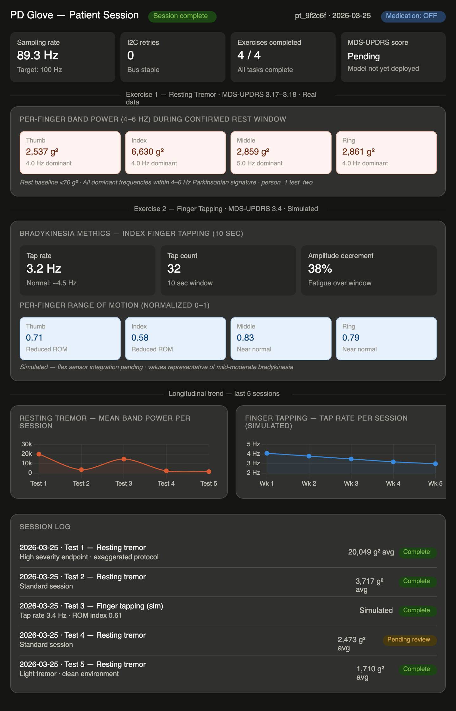

# PD-Glove Cloud Data Contract for Mobile/Web Team

This design doc defines the data sent over the internet from the PD-glove edge gateway (Raspberry Pi 5) to application services.

It is based on:

- current repository implementation (`scripts/sensor_reader.py`, `scripts/dsp_pipeline.py`)
- current repo docs and validation notes
- paper-level architecture and requirements from the provided manuscript excerpt

---

## 1) Contract goals

- Give app/backend teams a stable, versioned payload contract.
- Keep cloud payloads clinically useful and privacy-preserving.
- Separate **current production-ready fields** from **planned fields** (flex integration pending).

---

## 2) Privacy boundary (non-negotiable)

Data **not sent** to cloud by default:

- raw IMU sample streams (`ax/ay/az/gx/gy/gz` at sampling rate)
- raw flex ADC streams (`0-1023` time series)
- unencrypted plaintext video

Data sent:

- exercise-level and/or window-level derived metrics
- model outputs and confidence (when inference module is active)
- session/context metadata
- sensor and pipeline health indicators

---

## 3) Transmission model

- Protocol: MQTT JSON payloads
- Granularity: **exercise-centric** (primary), with optional event/window messages
- Ordering: at-least-once delivery expected; consumers must deduplicate by `message_id`
- Timestamps: UTC ISO-8601

---

## 4) Versioning and compatibility

Top-level required fields for every message:

- `schema_version` (string, e.g. `"2.0.0"`)
- `message_type` (enum)
- `message_id` (UUID/string idempotency key)
- `generated_at` (UTC timestamp on edge device)
- `device_id` (pseudonymous device ID)
- `session_id` (logical session identifier)

Compatibility rules:

- additive fields are allowed in minor versions
- consumers must ignore unknown fields
- breaking changes require major version bump

---

## 5) Message types

### 5.1 `exercise_summary` (primary contract)

One message per exercise task (rest, finger tapping, hand open/close, pronation/supination).

```json
{
  "schema_version": "2.0.0",
  "message_type": "exercise_summary",
  "message_id": "6a8a88b7-4c37-4e7b-b93f-e2306146f0be",
  "generated_at": "2026-03-25T17:41:56Z",
  "device_id": "pdg-001",
  "patient_id_hash": "pt_9f2c6f",
  "session_id": "sess_20260325_1741",
  "hand_side": "right",
  "exercise": {
    "code": "rest_tremor",
    "mds_updrs_item": "3.17-3.18",
    "expected_duration_s": 30,
    "actual_duration_s": 30,
    "status": "complete",
    "med_state": "unknown"
  },
  "tremor": {
    "enabled": true,
    "sample_rate_hz_target": 100.0,
    "sample_rate_hz_effective": 89.25,
    "channels": [
      {
        "finger": "thumb",
        "channel": 0,
        "axis": "ax",
        "dominant_freq_hz_4_6": 4.0,
        "dominant_amp_4_6": 24.302194,
        "band_power_4_6": 2536.787274
      },
      {
        "finger": "index",
        "channel": 1,
        "axis": "ax",
        "dominant_freq_hz_4_6": 4.0,
        "dominant_amp_4_6": 45.555303,
        "band_power_4_6": 6629.875246
      },
      {
        "finger": "middle",
        "channel": 2,
        "axis": "ax",
        "dominant_freq_hz_4_6": 5.0,
        "dominant_amp_4_6": 21.388471,
        "band_power_4_6": 2859.482638
      },
      {
        "finger": "ring",
        "channel": 3,
        "axis": "ax",
        "dominant_freq_hz_4_6": 4.0,
        "dominant_amp_4_6": 27.585935,
        "band_power_4_6": 2861.246377
      }
    ]
  },
  "flex": {
    "enabled": false,
    "status": "not_integrated"
  },
  "model_output": {
    "updrs_score_0_4": null,
    "confidence": null,
    "model_version": null
  },
  "quality": {
    "retry_events_i2c": 0,
    "dropped_windows": 0,
    "state_validity": true,
    "compliance_flag": "pending_video_review"
  },
  "security": {
    "transport": "mqtt_tls",
    "payload_encrypted": true
  }
}
```

### 5.2 `session_summary` (optional rollup)

One message after all exercises in a session complete/interrupted. Contains aggregate metrics and status for dashboard timelines.

### 5.3 `device_health` (optional operational telemetry)

Periodic non-clinical telemetry for reliability:

- current effective sampling rate
- sensor/channel failures
- queue depth and publish retries

---

## 6) Sensor-specific cloud fields

### 6.1 MPU6050 (tremor)

Source in repo:

- `scripts/sensor_reader.py`: captures `ax, ay, az, gx, gy, gz` per channel
- `scripts/dsp_pipeline.py`: computes tremor-band metrics in 4-6 Hz from filtered signal

Cloud fields for tremor (current path):

- `sample_rate_hz_target` (float)
- `sample_rate_hz_effective` (float)
- per channel/finger:
  - `dominant_freq_hz_4_6` (float)
  - `dominant_amp_4_6` (float)
  - `band_power_4_6` (float)

Recommended channel map:

- 0 thumb
- 1 index
- 2 middle
- 3 ring
- 4 pinky

### 6.2 Flex sensors (stiffness/bradykinesia)

Status in repo:

- hardware path defined (5 flex + MCP3008), integration pending
- no active flex processing script currently committed

Planned cloud fields (send only after integration is validated):

- per finger:
  - `tap_count`
  - `tap_rate_hz`
  - `rom_norm` (normalized range-of-motion, 0-1)
  - `velocity_mean`
  - `velocity_cv` (coefficient of variation)
  - `amplitude_decrement_pct`
  - `stiffness_index` (derived composite)

Interim behavior before flex integration:

- keep `flex.enabled=false`
- include `flex.status="not_integrated"` so app does not misinterpret missing values as zero pathology

---

## 7) Exercise semantics for app team

Exercise codes and clinical mapping:

- `rest_tremor` -> MDS-UPDRS 3.17-3.18
- `finger_tapping` -> MDS-UPDRS 3.4
- `hand_open_close` -> MDS-UPDRS 3.5
- `pronation_supination` -> MDS-UPDRS 3.6

`status` enum:

- `complete`
- `incomplete`
- `interrupted`
- `invalidated`

If interrupted/incomplete, still publish payload with:

- partial metrics
- `status` not `complete`
- interruption reason in `quality` or `interruptions[]`

This is clinically meaningful for longitudinal analysis.

---

## 8) Field definitions and units

- Frequencies: Hz
- Durations: seconds
- Amplitudes/power: unitless relative DSP outputs unless calibrated later
- Scores: `0-4` integer/float for MDS-UPDRS aligned outputs
- Confidence: `0.0-1.0`
- `state_validity`: boolean indicating whether captured state matches expected exercise condition

---

## 9) Validation and null-handling requirements

Consumer requirements:

- treat `null` as unavailable, not zero
- check `flex.enabled` before displaying stiffness widgets
- gate clinical rendering on `status` + `state_validity`
- deduplicate with `message_id`

Producer requirements:

- always include top-level required fields
- always include `quality` object
- never silently drop failed channels; mark per-channel quality/health

---

## 10) Suggested MQTT topics

- `pdglove/v2/exercise_summary/{device_id}`
- `pdglove/v2/session_summary/{device_id}`
- `pdglove/v2/device_health/{device_id}`

---

## 11) Current vs planned matrix (important)

Current implemented in repo:

- IMU capture (5 channels), tremor DSP metrics, CSV outputs
- no committed MQTT publisher module yet
- no committed TFLite inference module yet
- flex hardware/software integration pending

Planned contract support:

- publish exercise JSON over MQTT
- include model outputs and confidence
- include flex-derived stiffness/bradykinesia metrics

App team should build for forward compatibility using `schema_version`, `enabled` flags, and nullable fields.

---

## 12) Minimal TypeScript interface (for frontend/backend)

```ts
type ExerciseStatus = "complete" | "incomplete" | "interrupted" | "invalidated";
type MessageType = "exercise_summary" | "session_summary" | "device_health";

interface PdGloveMessageBase {
  schema_version: string;
  message_type: MessageType;
  message_id: string;
  generated_at: string;
  device_id: string;
  session_id: string;
}
```

---

## 13) Implementation notes for mobile/web

- Keep UI components split into:
  - tremor panel (active now)
  - stiffness/bradykinesia panel (feature-flag until `flex.enabled=true`)
- Store raw received JSON for auditability; derive visualization models separately.
- Preserve UTC timestamps end-to-end; perform timezone conversion only in presentation layer.

---

## 14) Dashboard guidance for patient and provider application



The application surfaces session data to two audiences with different needs.

### Patient view

- **Session status** — did the exercise complete successfully (`exercise.status`)
- **Per-finger tremor indicator** — a simple severity indicator per finger derived from `band_power_4_6`, not raw numbers
- **MDS-UPDRS score** — shown once `model_output.updrs_score_0_4` is available; display as pending until TFLite is integrated
- **Longitudinal trend** — tremor severity across sessions over time; this is the primary clinical value for the patient

### Provider view

- **Session summary per patient** — exercise completion status, medication state (`med_state`), and any flagged sessions (`compliance_flag`)
- **Trend charts** — band power and eventual UPDRS scores across sessions, surfaced at the patient level
- **Session integrity indicators** — `state_validity` and `compliance_flag` tell the provider whether a session's data can be trusted clinically
- **Incomplete session data** — always show interrupted/incomplete sessions with their status; a patient unable to complete finger tapping for 10 seconds is clinically meaningful

### What not to show

Do not surface raw DSP values (`dominant_freq_hz_4_6`, `dominant_amp_4_6`, `band_power_4_6` as numbers) directly to patients or providers — these are engineering units. Translate them into severity indicators or UPDRS-aligned outputs before display.

### Gating rule

Only render clinical values when all three hold:
1. `exercise.status === "complete"`
2. `quality.state_validity === true`
3. `quality.compliance_flag !== "invalidated"`

Otherwise mark the session as flagged and exclude it from trend calculations.

---

## Notes

> **Example data source:** All channel values in Section 5.1 are drawn from real hardware validation data — `person_1 test_two` from `data/tremor_validation_master.csv`, recorded `2026-03-25T17:41:56Z`. This was a standard tremor session with no exaggerated intensity protocol, representative of a typical mid-severity run. Effective sampling rate (89.25 Hz), retry count (0), and all four per-finger DSP metrics are taken directly from the CSV without modification. `model_output` fields remain null as TFLite inference was not yet integrated at time of capture.
