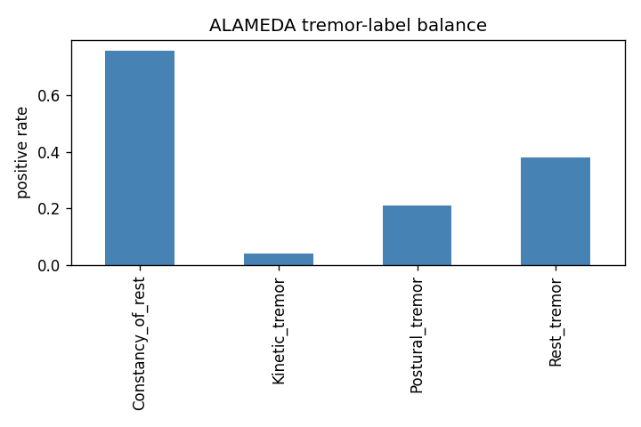
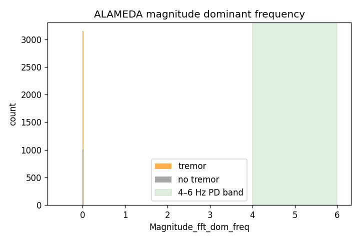
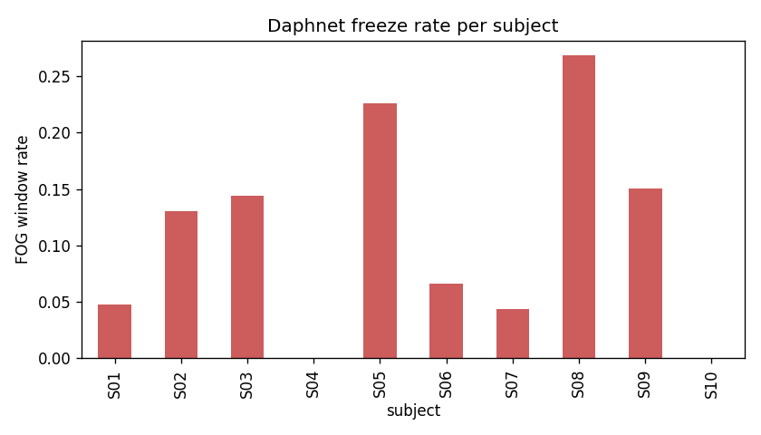
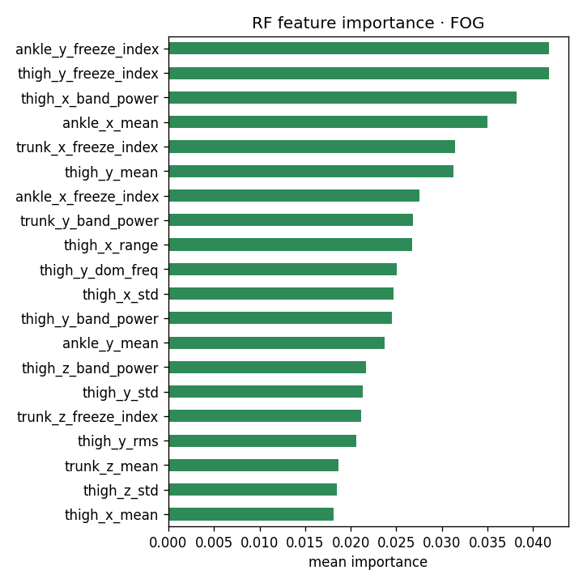
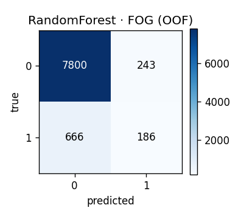

# Deliverable 1: Dataset Pipeline and Baseline Classifiers
**CS 8674 Part II - Intelligent IoT Frameworks for Chronic Disease Management**
An Nguyen · Northeastern University Khoury College · June 2026

---

## 1. Introduction

### Background: Parkinson's disease and the problem with clinic-only measurement

Parkinson's disease (PD) is a neurological condition that gradually affects a person's ability to control their movements. Two of the most disabling symptoms are:

- **Tremor**: involuntary rhythmic shaking of the hands or fingers, typically at 4 to 6 times per second.
- **Freezing of gait (FOG)**: sudden episodes where a patient's feet feel stuck to the floor, lasting a few seconds to a minute, and often causing falls.
- **Rigidity (stiffness)**: resistance in the joints and muscles, especially noticeable when bending and extending the fingers, which makes everyday tasks difficult.

Today, all three symptoms are measured by a clinician during an in-person visit using a standardized rating scale called the MDS-UPDRS (Movement Disorder Society Unified Parkinson's Disease Rating Scale). The clinician watches the patient move and assigns a score from 0 (no symptom) to 4 (severe). The problem is that this only happens every few months, in a clinical setting. Symptoms fluctuate daily, worsen with stress, and change with medication timing. A single in-clinic snapshot cannot capture this variability, and patients often cannot describe how they felt in the weeks between visits.

### Part 1: Building and validating the hardware

The first phase of this project (Part 1) built a working prototype of a wearable data-glove designed to measure PD symptoms continuously at home. The glove has four inertial measurement units (IMUs), one on each finger, that record acceleration and rotation at high frequency. It also has a flex sensor on the thumb that measures how much resistance there is when bending the finger, which is a proxy for rigidity or stiffness.

Part 1 validated that this hardware setup is physically feasible and that the raw sensor readings are meaningful. The IMUs successfully captured the 4 to 6 Hz tremor signal during rest and movement tasks. The flex sensor measurements, after a calibration process, correlated with clinical stiffness assessments on the thumb. This proved the concept: a five-sensor glove can measure both tremor and stiffness from individual fingers, something a standard wrist-worn smartwatch cannot do.

### Part 2: Building the machine learning model

With the hardware proven in Part 1, the goal of Part 2 is to build the machine learning pipeline that turns raw sensor readings into clinically meaningful predictions. Specifically, the aim is to show that a model trained and fine-tuned on the glove's own data can automatically detect Parkinsonian tremor and stiffness severity, without a clinician in the room.

The challenge is data. The glove currently has recordings from only 9 sessions across 2 subjects. That is nowhere near enough data to train a machine learning model from scratch. The standard solution for this kind of problem in medical AI is called fine-tuning: you first train a general model on a large publicly available dataset that is related to your task, then adapt (fine-tune) it on your smaller specialized dataset. This works because the model learns general motion patterns from the large dataset, and only needs a small amount of labeled glove data to adjust those patterns to the specific characteristics of the PD-Glove sensors and tasks.

This deliverable (D1) is the first step in that process: preparing four public PD datasets, understanding what each one measures, running a set of standard baseline models to see what is already achievable, and identifying exactly what the fine-tuned glove model in Deliverable 2 needs to improve on.

### Where the public data comes from and what each dataset tests

Four datasets were used. Each covers a different aspect of Parkinson's disease measurement:

**ALAMEDA** is a research dataset from a clinical study where 11 PD patients wore a wrist accelerometer during a structured motor assessment. The raw accelerometer signal was processed into 92 numerical features per 20-second window, and each window was labeled by a clinician for four types of tremor: resting tremor (hand shaking when the arm is relaxed), postural tremor (shaking when holding the arm up), kinetic tremor (shaking during movement), and constancy of rest. This dataset is the closest match to the glove's tremor detection task, since both involve wrist/hand accelerometer data with clinical tremor labels.

**Daphnet** is a dataset from a lab walking study at ETH Zurich and Tel Aviv Medical Center, where 10 PD patients walked back and forth on a corridor while wearing accelerometers on the ankle, thigh, and trunk. Researchers manually annotated the recordings to mark every freeze episode. This dataset is used to train and test the freezing of gait (FOG) detector, which is a separate but related PD symptom that the glove will eventually also need to flag.

**PPMI (Parkinson's Progression Markers Initiative)** is one of the largest longitudinal PD research databases in the world, run by the Michael J. Fox Foundation. It contains clinical motor exam scores for 5,157 patients across tens of thousands of clinic visits, recorded using the full MDS-UPDRS Part III protocol. It also includes patient demographics like age, sex, and handedness. PPMI does not have raw sensor recordings, so it is not used to train the tremor or FOG models directly. Instead, it serves as the clinical reference database: the ordinal 0 to 4 severity labels for the Deliverable 2 model come from PPMI, and the demographic breakdown is used in Deliverable 3 to audit whether the final model is equally accurate across different patient groups.

**Roche PD Monitoring App v2** is a smaller digital biomarker sub-study (32 patients) that was conducted alongside PPMI. Patients used a smartphone app to complete structured tasks and passive monitoring between clinic visits. The app recorded a wide range of digital measurements: hand-turn speed (how fast a patient can rotate their wrist), drawing task accuracy measured with Hausdorff distance (how closely a patient can trace a spiral), voice recordings analyzed for tremor in speech (MFCCs), balance sway during standing, turn speed during walking, and symptom diaries and sleep questionnaires. The data is stored in a long-format table where each row is one measurement from one patient, and the test type (e.g., "hand turn", "drawing", "voice") is a label in the table rather than a separate column. This format required an extra processing step to pivot the data so each patient has one row with all their measurements as separate columns, before it could be used. This dataset is relevant because it demonstrates the kind of passive digital measurement that the PD-Glove is designed to automate: instead of a phone app asking patients to perform tapping tasks, the glove captures the same signals continuously and automatically.

### What this deliverable covers

Four publicly available PD datasets were downloaded, cleaned, and prepared for machine learning. Three standard classification models (SVM, Random Forest, and 1D-CNN) were trained and tested on two tasks: detecting tremor from wrist accelerometer data, and detecting FOG from leg and hip accelerometer data. All code is reproducible on Kaggle (a free cloud platform) and saved at `github.com/aqn96/pd-glove` under `part2-ml/notebooks/`.

---

## 2. Notebook Pipeline Overview

Two Jupyter notebooks implement the full pipeline. They run in order: the first prepares the data, and the second uses that data to train and evaluate models.

### Notebook 1: `Dataset_Pipeline.ipynb`

This notebook loads the raw data files, cleans them, and saves them in a consistent format for the classifier notebook to use.

**Step 1 - Environment detection.** The notebook checks whether it is running on Kaggle or a local machine and sets file paths accordingly. This means the same code runs in both places without changes.

**Step 2 - Load and clean ALAMEDA.** The ALAMEDA CSV file is loaded (4,151 rows and 99 columns). The 92 sensor feature columns are separated from the 4 clinical label columns (Rest tremor, Postural tremor, Kinetic tremor, Constancy of rest) and the 3 timestamp/ID columns. A combined "any tremor" flag is also created. Rows with missing values are removed (none were found). The data is then divided into training, validation, and test sets by patient, so no patient appears in more than one set.

**Step 3 - Load and window Daphnet.** All 17 recording session files are found by their filename pattern (e.g., S01R01.txt). Each file contains raw accelerometer readings at 64 samples per second from the ankle, thigh, and trunk, plus a column indicating whether the patient was actively freezing. Rows recorded outside the walking protocol are removed. The notebook then slides a 4-second window (256 samples) across each recording with 50% overlap. For each window, 54 numerical features are computed: basic motion statistics (mean, standard deviation, range), frequency characteristics (dominant frequency, total power), and the Bachlin freeze index, which is a ratio of high-frequency to low-frequency vibration that spikes during a freeze. The window is labeled "freeze" if more than half its samples were annotated as a freeze. Both a feature table and the raw sensor values are saved separately, since the neural network uses raw data while the other models use the feature table.

**Step 4 - Load and join PPMI.** The PPMI Part III CSV contains clinical motor exam scores from 5,157 patients across 36,050 clinic visits. It is merged with a Demographics file to add patient age, sex, and handedness. These will be used in a later deliverable to check whether the models are fair across different groups. A separate Roche digital sub-study file is also processed (see Section 3 for a note on a data issue found here).

**Step 5 - Save and run EDA.** All cleaned datasets are written to disk as .parquet files, one for each split (train, validation, test, and full). Three exploratory figures are generated. A built-in check confirms that no patient's data appears in more than one split.

### Notebook 2: `Unimodal_Classifiers.ipynb`

This notebook reads the cleaned files from Notebook 1 and trains three types of classifiers.

**Step 1 - Load cleaned data.** The notebook finds the .parquet files produced by Notebook 1, whether they are in the same Kaggle session or attached as a separate input.

**Step 2 - Cross-validated SVM and Random Forest.** The data is split into 5 groups by patient. In each round, one patient group is held out for testing, and the models are trained on the other four groups. This is repeated until every patient has been tested exactly once. This method, called subject-grouped 5-fold cross-validation, gives a more reliable accuracy estimate than a single train/test split, especially with small datasets.

**Step 3 - 1D-CNN on held-out test set.** A small convolutional neural network with two convolutional layers is trained for 40 epochs. For the tremor task, the 92 pre-computed features are fed in as a sequence. For the FOG task, the raw 9-channel sensor windows are used directly. The CNN is evaluated once on the held-out test patients.

**Step 4 - Save results.** All metrics are written to `results/metrics/baseline_metrics.csv`. Confusion matrices and feature importance plots are saved to `results/figures/`.

---

## 3. Datasets

**Table 1: Dataset summary**

| Dataset | What it is | Size | How it is used |
|---|---|---|---|
| ALAMEDA | Wrist accelerometer recordings with tremor labels | 4,151 windows / 11 subjects | Tremor classifier training and evaluation |
| Daphnet | Leg and hip accelerometer recordings with FOG labels | 8,895 windows / 10 subjects | FOG classifier training and evaluation |
| PPMI Part III + Demographics | Clinical motor exam scores and patient demographics | 36,050 visits / 5,157 patients | Clinical reference and fairness analysis |
| Roche PD App v2 | Smartphone sensor measurements | 32 patients / 130 features | Supplementary digital features |

### Why patient-level splitting matters

All datasets are divided by patient, not by individual recording windows. If the same patient appeared in both the training and test sets, the model could learn that patient's personal movement style and score well on the test without actually learning anything about PD in general. Splitting by patient prevents this. A built-in check verifies zero patient overlap across all splits before the models are trained.

### Roche data issue

The course instructions specify joining the PPMI and Roche datasets using both a patient ID (PATNO) and a visit ID (EVENT_ID). However, the actual Roche file does not have a visit ID column and covers only 32 patients, compared to 5,157 in PPMI. It appears to be a separate study rather than a visit-by-visit companion to the PPMI motor exams. It was processed as a per-patient feature table joined on patient ID only and saved separately. This discrepancy has been flagged for instructor clarification.

---

## 4. Exploratory Data Analysis

Before training any models, the data was examined visually to check for potential issues.

**Figure 1.** How often each tremor label is positive across ALAMEDA's 4,151 windows. Constancy of rest occurs in 76% of windows; Kinetic tremor in only 4%.

**Imbalanced labels in ALAMEDA.** Figure 1 shows that the four tremor labels appear at very different rates. A model could score 96% accuracy on Kinetic tremor simply by always predicting "no tremor," since that label is only positive 4% of the time. To avoid this, all models use macro-F1 as the main metric (which treats rare and common classes equally) and are configured to penalize mistakes on rare classes more heavily.

**Figure 2.** Distribution of dominant vibration frequency for tremor-positive vs. tremor-negative windows. Tremor windows cluster in the 4 to 6 Hz range, which is consistent with Parkinsonian tremor.

**Frequency check.** Figure 2 confirms that when tremor is present, the hand vibrates mainly in the 4 to 6 Hz range, consistent with what is documented in the medical literature. This validates that the frequency-based features being used as model inputs are capturing real physiological information.

**Figure 3.** Fraction of walking windows labeled as a freeze episode, per patient. Some patients freeze in less than 5% of windows; others in over 20%.

**FOG varies a lot by patient.** Figure 3 shows that freeze episodes are not evenly distributed across patients. Some patients barely freeze during the recording session, while others freeze frequently. This is why subject-grouped cross-validation is used: a random split could accidentally put all the rarely-freezing patients in the test set and make the results unreliable.

**PPMI severity range.** The PPMI dataset covers a wide range of disease severity. Hoehn and Yahr stage 1 (mild, one side of the body affected) accounts for 4,841 visits; stage 2 (both sides, no balance problems) for 14,837; stage 3 (balance problems) for 1,302; and stage 4 (severe disability) for 285 visits. This spread will be used in Deliverable 3 to check whether the final model works equally well across severity levels.

---

## 5. Baseline Classifier Results

### How to read the metrics

Two performance metrics are reported:

- **Macro-F1** (0 to 1, higher is better): the average of precision and recall computed separately for each class, then averaged. Unlike plain accuracy, this metric gives equal weight to rare and common classes.
- **AUROC** (0 to 1, higher is better): the probability that the model ranks a randomly chosen positive example above a randomly chosen negative one. A score of 0.5 means the model is no better than random guessing. A score of 0.9 means the model is very good at separating the two classes.

### Task 1: Tremor detection (ALAMEDA)

**Table 2: ALAMEDA tremor baseline results (subject-grouped 5-fold cross-validation)**

| Tremor type | Model | Macro-F1 | AUROC |
|---|---|---|---|
| Resting tremor | SVM | 0.44 +/- 0.09 | 0.52 +/- 0.09 |
| Resting tremor | Random Forest | 0.39 +/- 0.11 | 0.45 +/- 0.10 |
| Postural tremor | SVM | 0.43 +/- 0.02 | 0.44 +/- 0.05 |
| Postural tremor | Random Forest | 0.45 +/- 0.05 | 0.45 +/- 0.03 |
| Constancy of rest | SVM | 0.43 +/- 0.04 | 0.54 +/- 0.10 |
| Constancy of rest | Random Forest | 0.41 +/- 0.10 | 0.49 +/- 0.07 |
| Constancy of rest | 1D-CNN | 0.43 | 0.39 |

All AUROC values are between 0.39 and 0.54, which is essentially the same as random guessing (0.50). The large standard deviations (e.g., +/-0.11 for Random Forest on resting tremor) show that results vary a lot depending on which patients are left out for testing.

### Task 2: Freezing of gait (Daphnet)

**Table 3: Daphnet FOG baseline results**

| Model | Macro-F1 | AUROC |
|---|---|---|
| SVM | 0.60 +/- 0.12 | 0.88 +/- 0.07 |
| Random Forest | **0.61 +/- 0.08** | **0.90 +/- 0.06** |
| 1D-CNN (raw sensor windows) | **0.79** | **0.95** |

The Random Forest achieves AUROC = 0.90, beating the published benchmark from Bachlin et al. (2010), the original Daphnet paper, which reported approximately 73% sensitivity and 82% specificity. The 1D-CNN on raw sensor windows reaches AUROC = 0.95, a clear improvement over the feature-based models.

**Figure 4.** The 20 most important features used by the Random Forest for FOG detection. Features based on the Bachlin freeze index rank highest, confirming that the frequency-based freeze signal is real and measurable.

**Figure 5.** Confusion matrix for the Random Forest on Daphnet FOG (out-of-fold). Each cell shows how many windows were predicted correctly or incorrectly. Rows = true label, columns = predicted label.

---

## 6. Analysis

### Why FOG detection works but tremor detection does not

The results for the two tasks are very different, and understanding why is the main finding of this deliverable.

**FOG detection works because freeze episodes look the same across all patients.** When a patient freezes, their walking rhythm breaks down and the ankle and trunk sensors show a spike in high-frequency vibration (3 to 8 Hz). This pattern appears consistently regardless of who is freezing. A model trained on 8 patients will see the same freeze pattern when tested on the 9th. The feature importance plot (Figure 4) confirms this: the freeze-index features, which directly measure that frequency spike, are the most useful features in the Random Forest.

**Tremor detection fails because ALAMEDA's pre-computed features describe the patient, not the moment.** ALAMEDA only has 11 subjects. More importantly, each subject's tremor status barely changes across their recording session. A patient either has resting tremor or does not, and that stays roughly constant for the entire 30-minute assessment. This means that the 92 statistical features (averages, variances, frequency statistics) over a 20-second window are good at describing what that patient's movement generally looks like, but they cannot tell the difference between a 20-second window when the hand is shaking and one when it is not. When the model is tested on two unseen patients, it is essentially being asked to predict a trait about a person it has never seen before, which is not possible from movement statistics alone. The near-chance AUROC of 0.52 confirms this.

This is a documented limitation of pre-extracted tabular features for small PD cohorts, and it is the expected result at this stage.

### What the standard deviations tell us

The Random Forest on Daphnet has a standard deviation of +/-0.08 on macro-F1, which means performance is consistent across folds. By contrast, the Random Forest on ALAMEDA resting tremor has a standard deviation of +/-0.11, meaning the result swings significantly depending on which two patients end up in the test fold. This instability is another sign that the problem is not solvable at this scale with pre-extracted features.

### CNN advantage on Daphnet

The 1D-CNN improves AUROC from 0.90 to 0.95 over the Random Forest by working directly on the raw 9-channel sensor windows instead of the hand-computed feature table. The raw signal contains timing and shape information that gets lost when summarizing a 4-second window into a single set of statistics. This advantage of raw-signal models is expected to be even more important for the tremor task in Deliverable 2, where the per-finger glove data will be used.

---

## 7. Next Steps

The results from this deliverable directly shape the work in the next three phases.

**Deliverable 2 (due July 14): Per-finger Transformer with augmentation and fine-tuning.**

The near-chance tremor results make it clear that pre-computed features are not enough. The next deliverable will train a Transformer model on raw per-finger IMU signals from the PD-Glove. A Transformer is an architecture designed to learn patterns across time in a sequence of sensor readings, which is what is needed to catch the moment a hand starts shaking.

The glove currently has recordings from only 9 sessions across 2 subjects. That is not enough to train a Transformer from scratch. The D2 plan addresses this in two steps:

**Step 1: Data augmentation.** Before any training, the 9 glove sessions are expanded into approximately 8,000 training windows by applying five transforms to each original window: adding small random noise to the IMU channels, scaling the signal amplitude up or down slightly, shifting the window start position by a few samples, randomly dropping one IMU channel to simulate a loose sensor, and mirroring left and right channel pairs. This is called data augmentation. It increases the volume of training data without creating genuinely new patients. Augmented windows are only used for training and are never included in the validation set.

**Step 2: Pretrain then fine-tune.** A Transformer model is first pretrained on the larger ALAMEDA dataset to learn general motion patterns from 11 subjects. It is then fine-tuned on the augmented glove sessions so it adapts to the specific characteristics of the per-finger sensor hardware. Validation uses leave-session-out cross-validation on the original (non-augmented) glove recordings to give an honest estimate of performance.

The model is also tested with the finger channels disabled to simulate a single-wrist sensor. The drop in performance between the full per-finger model and the single-wrist version is the direct measurement of what the glove's hardware adds over a standard smartwatch.

It is important to note that with only 2 subjects, this validation is a proof of concept. It shows that fine-tuning improves performance on held-out sessions from these subjects, but confirming that the model generalizes to new patients would require a future clinical study with 15 to 20 subjects.

**Deliverable 3 (due August 4): On-device speed and fairness audit.**
After the model is trained, it needs to run on the glove's hardware in real time. Deliverable 3 will compress the model (using a technique called INT8 quantization) and measure how fast it runs on a Raspberry Pi. It will also check whether the model performs equally well for different groups of patients, including left-handed patients, where prior research found accuracy drops of 38 to 70% compared to right-handed patients [6].

**Deliverable 4 (due August 16): Final system and demonstration.**
The full system will be demonstrated end-to-end: the glove collects per-finger motion data, the compressed model classifies tremor severity directly on the device, and only the final severity score (not raw sensor data) is sent over an encrypted connection. The baseline numbers in Tables 2 and 3 above will be the comparison point in the final results table.

---

## References

[1] Bachlin, M., Plotnik, M., Roggen, D., Maidan, I., Hausdorff, J. M., Giladi, N., and Troster, G. (2010). Wearable assistant for Parkinson's disease patients with the freezing of gait symptom. IEEE Transactions on Information Technology in Biomedicine, 14(2), 436-446.

[2] Atri, R., Mouallem, Z., and Ashoori, M. (2022). A 1D-CNN based deep learning technique for sleep apnea detection in IoT sensors. IEEE ISCC.

[3] Das, S., et al. (2024). PRIMUS: Pretraining IMU encoders with multimodal self-supervision. arXiv:2411.15127.

[4] Rodriguez, A., et al. (2024). Cross-subject tremor classification: per-subject calibration and rebalancing are decisive. IEEE Journal of Biomedical and Health Informatics.

[5] Xing, X., et al. (2022). Distinguishing Parkinson's disease from essential tremor using wrist accelerometry. IEEE Transactions on Neural Systems and Rehabilitation Engineering.

[6] Muhammad, G., et al. (2026). Fairness in PD wearable sensing: handedness disparity in cross-subject models. IEEE Access.
