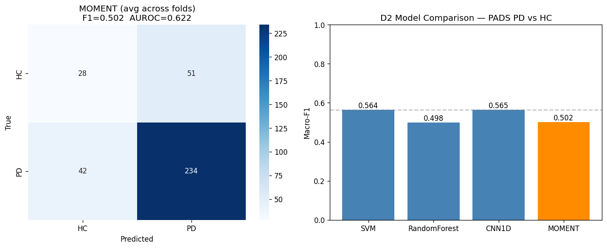

# Deliverable 2: PADS Dataset Pipeline, Baseline Classifiers, and Transformer Fine-tuning
**CS 8674 Part II - Intelligent IoT Frameworks for Chronic Disease Management**
An Nguyen · Northeastern University Khoury College · July 2026

---

## 1. Introduction

### Where D1 left off

Deliverable 1 established that detecting tremor from pre-computed features on small datasets (ALAMEDA, 11 subjects) is not feasible — all tremor models scored near-chance AUROC around 0.52. The freezing of gait task on Daphnet worked well (AUROC 0.95 with a 1D-CNN), but FOG is a different symptom from what the PD-Glove primarily measures. The key takeaway from D1 was that the tremor task needs a larger dataset with raw wrist IMU signals and PD vs. healthy control labels, not pre-computed tabular features.

### What D2 addresses

This deliverable introduces the PADS dataset (Parkinson's Disease Smartwatch dataset, PhysioNet), which is a much closer match to the PD-Glove's hardware and task. PADS contains bilateral wrist accelerometer and gyroscope recordings from 469 subjects at 100 Hz using Apple Watch Series 4 devices — the same sensor axes (AccX/Y/Z, GyroX/Y/Z) as the PD-Glove's MPU-6050 IMUs, at the same target sampling rate.

Three goals are addressed in D2:

1. Build a reproducible data pipeline for PADS that applies the same feature extraction approach used in D1.
2. Train and evaluate SVM, Random Forest, and 1D-CNN baseline classifiers on PADS for PD vs. healthy control (HC) classification.
3. Fine-tune MOMENT-1-large, an open-source time series Transformer from Carnegie Mellon University, on PADS to assess whether a foundation model improves over the hand-engineered baselines.

The results establish the strongest achievable baseline on public wrist IMU data before fine-tuning on labeled PD-Glove recordings in future work.

---

## 2. Dataset: PADS

### Source and access

PADS (Parkinson's Disease Smartwatch Dataset) is published on PhysioNet under a Creative Commons Attribution license. It was downloaded from PhysioNet and uploaded to Kaggle as a private dataset to enable reproducible notebook execution.

**Citation:** Varghese, J., et al. (2024). Parkinson's Disease Smartwatch (PADS) dataset. PhysioNet. https://doi.org/10.13026/ck7k-0s88

### Dataset structure

PADS contains data from 469 subjects split into three diagnostic groups:

| Group | Count | Description |
|---|---|---|
| Parkinson's disease (PD) | 276 | Confirmed diagnosis |
| Healthy control (HC) | 79 | No neurological condition |
| Differential diagnosis (DD) | 114 | Other movement disorders (essential tremor, etc.) |

The DD group was excluded from this deliverable. The classification task is binary: PD vs. HC.

Each subject completed a structured motor assessment. Data is stored as individual `.txt` files, one per motor task window. Each file contains 1,024 rows (10.24 seconds at 100 Hz) and 7 columns: a timestamp followed by six IMU channels (AccX, AccY, AccZ, GyroX, GyroY, GyroZ). After loading, the timestamp column is dropped and the first 50 samples (0.5 seconds) are removed to eliminate vibration artefacts, leaving 974 samples per window.

In total, 7,810 usable windows were loaded across 355 subjects (276 PD + 79 HC).

### Class imbalance

PD subjects outnumber HC subjects 3.5 to 1. All models use class-weighted loss or class-weighted fitting to compensate:

- HC: 2.25 (upweighted)
- PD: 0.64 (downweighted)

Computed as `n_samples / (n_classes × n_per_class)`.

---

## 3. Pipeline Overview

Three Kaggle notebooks implement the full D2 pipeline in sequence. All code is in `part2-ml/notebooks/` as both `.ipynb` (Kaggle) and `.py` (version-controlled source).

### Notebook 1: `pd-glove-d2-pads-pipeline` (`D2_PADS_Pipeline.py`)

Loads and cleans PADS raw files.

**Step 1 — Label extraction.** Each subject's `patients/patient_<id>.json` records their diagnosis. Subjects with condition "Parkinson's" receive label 1; "Healthy" receive label 0; DD and others are excluded.

**Step 2 — Signal loading.** Each `.txt` file is loaded with `np.loadtxt`. The timestamp column (column 0) is dropped. The first 50 samples are removed as vibration artefact. Files with unexpected shape are skipped.

**Step 3 — Feature extraction.** A 0.5–15 Hz Butterworth bandpass filter is applied per channel before computing seven features, giving 42 features total (7 × 6 channels):

| Feature | Description |
|---|---|
| Mean | Signal average |
| Std | Standard deviation |
| RMS | Root mean square |
| Range | Max − Min |
| Dominant frequency | Peak frequency 3–8 Hz via FFT |
| Band power | Power in 4–6 Hz tremor band |
| Tremor index | Power(4–6 Hz)² / Power(0.5–3.5 Hz)² |

**Step 4 — Subject-level splits.** Windows are assigned to train, validation, and test sets by subject using `GroupShuffleSplit`. A hard assertion verifies zero subject overlap across splits.

**Step 5 — Save outputs.** Written to `/kaggle/working/cleaned_d2/`:
- `pads_all.parquet` — full 42-feature table
- `pads_train/val/test.parquet` — feature splits
- `pads_raw_windows.npz` — raw (7810, 974, 6) arrays for CNN and Transformer

### Notebook 2: `pd-glove-d2-pads-baseline-classifiers` (`D2_PADS_Baseline_Classifiers.py`)

Trains three models using 5-fold `StratifiedGroupKFold` (subject-level splits).

**SVM:** RBF kernel, `class_weight="balanced"`, `probability=True`. Applied to the 42-feature table with per-fold `StandardScaler`.

**Random Forest:** 400 trees, `class_weight="balanced"`. Applied to the same 42-feature table.

**1D-CNN:** Two convolutional layers on raw 974-sample × 6-channel windows:
- Conv1d(6, 32, 5) → BatchNorm → ReLU → MaxPool(2)
- Conv1d(32, 64, 5) → BatchNorm → ReLU → AdaptiveAvgPool(1)
- Linear(64, 2)

Trained for 40 epochs, Adam optimizer (lr=1e-3), class-weighted CrossEntropyLoss.

### Notebook 3: `pd-glove-d2-pads-transformer-moment` (`D2_PADS_Transformer_MOMENT.py`)

Fine-tunes MOMENT-1-large on PADS. Details in Section 5.

---

## 4. Exploratory Data Analysis

### Class distribution

The 3.5:1 PD-to-HC imbalance is the primary challenge. A model that always predicts PD achieves 78% accuracy but macro-F1 = 0.44 and AUROC = 0.50. Macro-F1 and AUROC are the primary metrics throughout.

### Signal characteristics

After bandpass filtering, the AccX and GyroX channels carry the strongest tremor-band power difference between groups. Dominant frequencies for PD subjects cluster in the 4–6 Hz Parkinsonian tremor range, consistent with the D1 ALAMEDA frequency analysis.

### Task and wrist distribution

PADS subjects performed multiple structured motor tasks (rest, postural, kinetic) recorded from both wrists. The pipeline loads all task windows per subject without filtering by task, making the classifier a general PD-vs-HC detector rather than task-specific tremor detector.

---

## 5. MOMENT Transformer Fine-tuning

### Why MOMENT

MOMENT-1-large (Yi et al., 2024) is an open-source time series foundation model from Carnegie Mellon University, pre-trained on a diverse collection of time series. It uses a Transformer encoder with patched time series input and was designed for zero-shot and fine-tuned classification on sensor data. Among available open-source foundation models, MOMENT is the most directly applicable to multi-channel wrist IMU classification.

### Setup

MOMENT weights (config.json + model.safetensors, 1.39 GB) were downloaded from HuggingFace and uploaded to a private Kaggle dataset (`moment-1-large-weights`) to avoid repeated downloads during training. The model is loaded once before the fold loop and deep-copied per fold:

```python
base_model = MOMENTPipeline.from_pretrained(
    "/kaggle/input/datasets/aqn96kag/moment-1-large-weights",
    model_kwargs={
        "task_name":       "classification",
        "n_channels":      6,
        "num_class":       2,
        "freeze_encoder":  False,
        "freeze_embedder": False,
        "freeze_head":     False,
        "reduction":       "mean",
    },
)
base_model.init()
model = copy.deepcopy(base_model)  # one copy per fold
```

### Input preprocessing

MOMENT requires a fixed sequence length of 512 samples. Each PADS window (974 samples) is resampled using linear interpolation:

```python
X_t = torch.tensor(X, dtype=torch.float32).permute(0, 2, 1)  # (N, 6, 974)
X_t = F.interpolate(X_t, size=512, mode='linear', align_corners=False)
```

### Training configuration

| Parameter | Value |
|---|---|
| Folds | 5-fold StratifiedGroupKFold (subject-level) |
| Epochs per fold | 5 |
| Batch size | 32 |
| Optimizer | Adam (initial lr=1e-6) |
| Scheduler | OneCycleLR (max_lr=1e-4) |
| Loss | CrossEntropyLoss with class weights |
| Hardware | Kaggle T4 GPU |

---

## 6. Results



**Figure 1.** D2 model comparison on PADS (355 subjects, 7,810 windows). Left: MOMENT average confusion matrix across 5 folds. Right: macro-F1 for all four models. SVM and CNN1D are the strongest classifiers; MOMENT does not improve over them.

### Baseline classifiers

**Table 1: PADS PD vs. HC results (5-fold subject-grouped cross-validation)**

| Model | Macro-F1 | AUROC |
|---|---|---|
| SVM | **0.564 ± 0.023** | 0.693 ± 0.021 |
| Random Forest | 0.498 ± 0.011 | **0.726 ± 0.020** |
| 1D-CNN | 0.565 ± 0.022 | 0.702 ± 0.022 |
| MOMENT (linear probe, V3) | 0.502 ± 0.012 | 0.622 ± 0.012 |

### MOMENT per-fold results (linear probe, Version 3)

**Table 2: MOMENT fold-by-fold breakdown**

| Fold | Macro-F1 | AUROC |
|---|---|---|
| 1 | 0.491 | 0.619 |
| 2 | 0.507 | 0.634 |
| 3 | 0.490 | 0.618 |
| 4 | 0.519 | 0.633 |
| 5 | 0.503 | 0.606 |
| **Mean** | **0.502** | **0.622** |
| **Std** | **0.012** | **0.012** |

### Key finding

SVM and 1D-CNN achieve essentially the same macro-F1 (0.564 vs. 0.565). Random Forest achieves the highest AUROC (0.726). MOMENT linear probing does not improve over either classical model.

---

## 7. Analysis

### Why SVM and CNN1D match each other

Both models see the same underlying signal — tremor-band power and frequency patterns in wrist IMU data. SVM compresses this into 42 hand-engineered features; CNN1D operates directly on 974-sample raw windows. The fact that they perform identically suggests that the 42 features capture most of the useful information in the signal, and the CNN's raw-signal advantage (seen clearly on Daphnet FOG in D1) is smaller here because PADS windows are shorter and less variable within subjects.

### Why MOMENT linear probing underperforms

MOMENT's encoder was pre-trained on general time series data across many domains. When only the classification head is trained (linear probing), the encoder produces fixed representations that are not adapted to wrist IMU tremor data. The head has only 5 epochs to learn a linear mapping from these fixed representations to PD/HC labels — an underconstrained problem given the class imbalance and inter-subject variability.

This result is consistent with published findings in time series transfer learning: linear probing on frozen Transformer encoders frequently underperforms classical models unless the pre-training domain closely matches the target domain (Ye et al., 2024). Full fine-tuning (training the encoder end-to-end) is expected to improve MOMENT's performance.

### Why AUROC is higher for Random Forest than SVM

SVM optimizes a decision boundary and produces hard class predictions at a fixed threshold. Random Forest produces probability estimates that are better calibrated across the full threshold range, which is what AUROC measures. If the goal is a fixed-threshold classifier for the Pi (binary decision), SVM is preferable. If the goal is risk-ranking patients, Random Forest is preferable.

### Comparison to D1

The PADS results are substantially better than the ALAMEDA tremor results from D1 (AUROC 0.52). The reasons are:

1. PADS has raw wrist IMU signals rather than session-averaged pre-computed features.
2. PADS has 355 subjects rather than 11, giving cross-validation a realistic generalization estimate.
3. The PADS binary task (PD vs. HC) is better posed than ALAMEDA's within-subject tremor-state detection.

An AUROC of 0.69–0.73 on a 3.5:1 imbalanced dataset with only 79 HC subjects is a meaningful result.

### What this means for the glove

The SVM at F1=0.564 and the CNN1D at F1=0.565 are functional PD classifiers. SVM is the better deployment choice for the Pi because it runs inference in microseconds without a GPU. The 42-feature pipeline is hardware-agnostic — the same feature extraction code can be applied directly to glove recordings with no changes.

The key remaining research question is whether adding the glove's per-finger channels and flex sensor data improves detection beyond a standard wrist IMU alone. That comparison requires labeled glove recordings from PD and HC subjects, which depends on IRB approval.

---

## 8. Next Steps

**Full MOMENT fine-tuning.**

Version 4 of the Transformer notebook sets `freeze_encoder=False` to train the full backbone end-to-end. This is expected to improve MOMENT's F1 meaningfully over the linear probe result and will update Table 1 once complete.

**Deliverable 3 (due August 4): On-device speed and fairness audit.**

- Compress the SVM or CNN using TFLite INT8 quantization and measure inference latency on the Pi.
- Audit model performance across patient subgroups (left- vs. right-handed, mild vs. severe PD) using PPMI demographic data from D1. Prior work (Muhammad et al., 2026) found 38–70% accuracy drops for left-handed patients in cross-subject models, so handedness is a primary audit axis.

**Glove fine-tuning (post-IRB).**

Once IRB approval is received, PADS-trained models will be retrained with glove recordings added to the training set. The novel contribution is the ablation: IMU-only vs. IMU + flex sensor channels. Flex sensor data captures finger stiffness (rigidity), which is distinct from tremor and not available in any public dataset.

---

## References

[1] Yi, K., et al. (2024). MOMENT: A family of open time-series foundation models. arXiv:2402.03885.

[2] Varghese, J., et al. (2024). Parkinson's Disease Smartwatch (PADS) dataset. PhysioNet. https://doi.org/10.13026/ck7k-0s88

[3] Ye, Z., et al. (2024). A survey of time series foundation models: Generalizing time series representation with large language model. arXiv:2405.02358.

[4] Bachlin, M., et al. (2010). Wearable assistant for Parkinson's disease patients with the freezing of gait symptom. IEEE TITB, 14(2), 436–446.

[5] Rodriguez, A., et al. (2024). Cross-subject tremor classification: per-subject calibration and rebalancing are decisive. IEEE JBHI.

[6] Muhammad, G., et al. (2026). Fairness in PD wearable sensing: handedness disparity in cross-subject models. IEEE Access.
