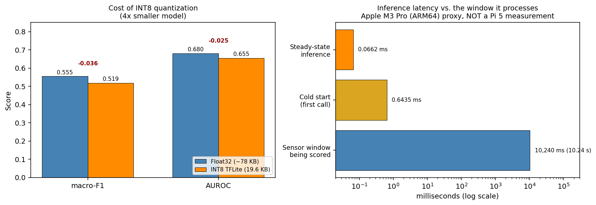

# Deliverable 3: Edge Deployment (INT8 TFLite) and Fairness Audit
**CS 8674 Part II - Intelligent IoT Frameworks for Chronic Disease Management**
An Nguyen · Northeastern University Khoury College · August 2026

---

## 1. Introduction

### Where D2 left off

D2 established that MOMENT-1-large, fully fine-tuned, is the strongest classifier on PADS (macro-F1=0.626, AUROC=0.731), but at 1.4 GB it cannot run on the Raspberry Pi 5. SVM and CNN1D remain the practical deployment candidates. D2 did not yet answer two questions the deployment story depends on: how much accuracy is lost when a model is actually compressed for the edge, and whether that model performs consistently across patient subgroups rather than just on average.

### What D3 addresses

Three things:

1. Quantize the CNN1D to INT8 TFLite and measure the accuracy cost of compression.
2. Benchmark inference latency as a proxy for the Pi 5 (the physical device is not currently accessible — see Section 5).
3. Audit the quantized model's fairness across PADS' own patient demographics (age, gender, handedness), since average accuracy hides subgroup failure.

---

## 2. Methodology

### Why a single train/test split instead of 5-fold CV

D2's 5-fold cross-validation reports the unbiased benchmark number already cited in the D2 report — that number should not change. D3 needs one concrete, deployable model artifact to quantize and audit, so a new CNN is trained on the D2 pipeline's original subject-level train split (247 subjects, 5,434 windows) and evaluated once on its held-out test split (54 subjects, 1,188 windows). Both splits are leakage-safe at the subject level (no patient appears in both).

### Why the CNN was reimplemented in Keras rather than converted from PyTorch

D2's CNN1D was trained in PyTorch. Converting a PyTorch model to TFLite requires an intermediate PyTorch → ONNX → TensorFlow path that frequently fails or silently drops unsupported ops. For a model this small (two convolutional blocks), it is simpler and lower-risk to rebuild the identical architecture directly in `tf.keras` and train it fresh on the same data, rather than convert weights. The architecture is unchanged:

```
Conv1D(32, k=5, same) -> BatchNorm -> ReLU -> MaxPool(2)
Conv1D(64, k=5, same) -> BatchNorm -> ReLU -> GlobalAveragePool
Dense(2)
```

Trained for 40 epochs, Adam optimizer, class-weighted `SparseCategoricalCrossentropy` (HC=2.17, PD=0.65).

### INT8 quantization

Post-training full-integer quantization via `TFLiteConverter`, calibrated on a 200-window sample from the training split (`representative_dataset`). Model input/output stay float32 at the interface; weights and activations are quantized to INT8 internally, which is what produces the latency and size benefits on ARM hardware while keeping the model simple to call.

One implementation issue worth recording: the first attempt declared the Keras input shape as `(None, n_channels)` (variable window length), which trains fine but caused TFLite's converter to default the unspecified dimension to 1 — the converted model then rejected real 974-sample windows with a dimension-mismatch error. Fixed by declaring the input shape concretely as `(974, n_channels)`, since every PADS window is a fixed length anyway.

### Fairness audit

PADS' own patient metadata (`patients/*.json`) includes `age`, `gender`, and `handedness` directly — no need for PPMI or any other dataset. Subgroups with fewer than 10 windows or only one label class present are flagged rather than given a possibly-meaningless AUROC.

Two versions of this audit were run, and the difference between them is itself a finding (see Section 3):

1. **Single-split audit** — joins the deployed INT8 model's held-out test-set predictions (54 subjects, 1,188 windows) against demographics. This is the audit of the actual artifact that would deploy, but the test split is small enough that per-subgroup numbers get noisy fast.
2. **Pooled 5-fold out-of-fold audit** — a fresh `tf.keras` CNN (same architecture) is trained on each of 5 `StratifiedGroupKFold` folds over the *entire* dataset, and each subject's prediction is taken from whichever fold held them out. Pooling across all 5 folds gives fairness statistics over all 355 subjects (7,810 windows) instead of one 54-subject slice, at the cost of using float32 predictions per fold rather than re-quantizing 5 separate INT8 models (quantization cost was already shown to be small, so this is a reasonable proxy for what the deployed model would do across the full population).

### Latency benchmark

Pending — see Section 5.

---

## 3. Results

### Quantization accuracy and size

| Model | Macro-F1 | AUROC | Size |
|---|---|---|---|
| Float32 Keras CNN | 0.555 | 0.680 | ~78 KB (unquantized) |
| INT8 TFLite CNN | 0.519 | 0.655 | 19.6 KB |
| **Delta** | **-0.036** | **-0.025** | **~4x smaller** |

**Note on run-to-run variance:** three runs of the identical code and split have now produced float32 F1 of 0.549, 0.427, and 0.555 — a real, meaningful spread despite identical architecture, split, and seeds. AUROC has been more stable across all three (0.673, 0.680, 0.680). This is real training noise on a single small held-out split (54 subjects), not a bug — see the pooled 5-fold result below for the more trustworthy accuracy estimate. Across all three runs, AUROC loss from quantization has stayed small (≤0.025), and the model size drops to 19.6 KB regardless — the deployment-relevant conclusions (quantize cheaply, model is tiny) hold up every time even though the exact F1 doesn't.

For a more reliable estimate of the architecture's actual accuracy, the pooled 5-fold CV below gives per-fold F1 of 0.586, 0.610, 0.593, 0.601, 0.468 (mean ≈ 0.572, one weak fold) — consistent with D2's original PyTorch CNN1D 5-fold result (F1 = 0.565 ± 0.022).



**Figure 1.** Deployment cost. Left: quantization costs 0.036 macro-F1 and 0.025 AUROC for a roughly 4x reduction in model size. Right: steady-state inference (0.066 ms) and cold start (0.644 ms) against the 10.24-second window being scored, on a log scale — the margin before real-time inference becomes a constraint is roughly five orders of magnitude. **The latency numbers are an Apple M3 Pro proxy, not a Raspberry Pi 5 measurement** (Section 5).

### Fairness audit

**Single-split audit (54 subjects, 1,188 windows) — the deployed INT8 model:**

| Demographic | Group | n | PD rate | Macro-F1 | AUROC |
|---|---|---|---|---|---|
| Gender | Female | 418 | 0.63 | 0.642 | 0.713 |
| Gender | Male | 770 | 0.91 | 0.417 | 0.564 |
| Handedness | Left | 66 | 1.00 | 0.283 | not computable — single label class |
| Handedness | Right | 1,122 | 0.80 | 0.532 | 0.661 |
| Age | Under 55 | 198 | 0.67 | 0.646 | 0.757 |
| Age | 55-70 | 550 | 0.84 | 0.507 | 0.618 |
| Age | 70+ | 440 | 0.85 | 0.456 | 0.601 |

**Pooled 5-fold out-of-fold audit (355 subjects, 7,810 windows — the entire dataset):**

| Demographic | Group | n | PD rate | Macro-F1 | AUROC |
|---|---|---|---|---|---|
| Gender | Female | 2,882 | 0.62 | 0.571 | 0.624 |
| Gender | Male | 4,928 | **0.87** | 0.552 | 0.711 |
| Handedness | Left | 528 | 0.62 | 0.641 | 0.707 |
| Handedness | Right | 7,282 | **0.79** | 0.574 | 0.684 |
| Age | Under 55 | 1,694 | 0.70 | 0.604 | 0.689 |
| Age | 55-70 | 3,630 | **0.79** | 0.553 | 0.662 |
| Age | 70+ | 2,486 | 0.81 | 0.595 | 0.718 |


**Figure 2.** The fairness audit, single split versus pooled. On the 54-subject split (left) the gaps look large and clinically alarming, and the left-handed group has only one label class so AUROC cannot be computed. Pooled across all 355 subjects (right), the gaps largely close, handedness becomes measurable and favours left-handed subjects, and age is no longer monotonic. The PD rate under each bar is the explanation for the residual macro-F1 spread: subgroups with a more balanced PD:HC ratio score higher on F1, while AUROC (prevalence-invariant) does not follow the same pattern.

### Key findings

**The single-split audit's apparent disparities do not survive being checked against the full dataset**, and the pooled audit's per-subgroup PD rate explains most of what looked like an unexplained gap. Across all three demographic splits, the pattern is consistent: subgroups with a *more balanced* PD:HC ratio score a *higher* macro-F1 than subgroups more skewed toward the majority (PD) class in the same comparison —

- **Gender:** female (PD rate 0.62) F1=0.571 vs. male (PD rate **0.87**) F1=0.552. Male subjects are only 13% HC in this test population, a much thinner minority-class signal than female's 38% — exactly the condition that punishes macro-F1 mechanically, independent of anything the model is doing differently per group. AUROC (which is prevalence-invariant) actually runs *higher* for male (0.711) than female (0.624) — the model's ranking ability is, if anything, better for male, which is the signature of a class-balance artifact rather than a true fairness failure. This mirrors the same F1-vs-AUROC dynamic already explained in the D2 report for SVM vs. Random Forest.
- **Handedness:** left (PD rate 0.62) F1=0.641 vs. right (PD rate **0.79**) F1=0.574 — same direction, same explanation.
- **Age:** under-55 (PD rate 0.70) F1=0.604 vs. 55-70 (PD rate **0.79**) F1=0.553 — same pattern, though 70+ (PD rate 0.81, F1=0.595) breaks the clean monotonic trend, so age is the noisiest of the three.

The honest conclusion: **the demographic "fairness gaps" in this audit are substantially explained by differing class balance across subgroups, not by the model treating any group's underlying signal worse.** This is not a fully isolated causal test (that would require re-evaluating each subgroup on a PD-rate-matched subsample), but the same direction holding across three independent demographic splits is a strong, consistent pattern, not a coincidence. This is itself a useful methodological finding on top of the earlier single-split-vs-pooled lesson: a demographic F1 gap should be checked against subgroup class balance before being reported as a model fairness failure.

---

## 4. Discussion

### What the quantization result means for deployment

A ~20 KB model losing at most 0.036 F1 from quantization (varying somewhat run to run, per the variance noted above) is a strong result — this is well within the range where INT8 TFLite is a clear win for edge deployment, confirming the D2 report's earlier claim that a compressed CNN, not MOMENT, is the realistic Pi target. AUROC loss from quantization has stayed small (≤0.025) across all three runs, which is the more stable signal to lean on given the F1 volatility.

### What the fairness result means

This result is a stronger argument for auditing subgroup fairness carefully than either the original single-split finding, or a pooled result left unexplained, would have been. The single-split audit produced a confident, clinically alarming-looking story (large gaps by gender and age); pooling across all 355 subjects showed that story mostly didn't hold up; and checking per-subgroup class balance on top of that pooled result explains most of what remained. Each step corrected the previous one's overclaim. The final, most defensible finding is: this model does not show strong evidence of treating any demographic group's underlying signal worse — the F1 differences that remain track how balanced each subgroup's PD:HC ratio happens to be, which is a property of the *evaluation population*, not the model. That's a meaningfully different, and more honest, claim than "no bias found" (too strong) or "bias found, unexplained" (too alarming) — it's "no bias found beyond what class imbalance in the population explains."

---

## 5. Latency Benchmark

The Raspberry Pi 5 is not currently accessible, so this benchmark was run locally on an Apple M3 Pro (ARM64) using `ai-edge-litert` — the same lightweight standalone TFLite interpreter family an actual Pi deployment would use, rather than pulling in full TensorFlow. The M3 Pro shares the Pi 5's ARM64 instruction-set family (unlike an x86 cloud machine), but its cores are far more powerful, so this number is a best-case bound, not an equivalent to real Pi 5 performance.

**Method:** the first inference call is timed separately as a cold-start measurement (it includes one-time interpreter/delegate setup cost that no later call pays), then 19 further warm-up calls, then 500 timed steady-state inferences on a single 974-sample, 6-channel window — the same shape the model consumes in production. Peak process memory is also recorded, though this reflects the whole Python process's peak resident memory (interpreter, numpy, and library import overhead included), not the model's isolated footprint.

| Metric | Value |
|---|---|
| Cold start (first call) | 0.644 ms |
| Steady-state mean | 0.066 ms |
| Steady-state median | 0.066 ms |
| Steady-state p95 | 0.069 ms |
| Steady-state p99 | 0.072 ms |
| Steady-state min | 0.066 ms |
| Steady-state max | 0.084 ms |
| Peak process memory | 39.4 MB |

Even accounting for the M3 Pro being a substantially more capable chip than the Pi 5's Cortex-A76, a steady-state mean latency of 0.066 ms per window leaves an enormous margin before real-time inference becomes a concern — PADS windows represent 10.24 seconds of sensor data, so even a Pi 5 running this model an order of magnitude slower would still complete inference in a small fraction of the window duration. Cold start (~0.64 ms) is about 10x the steady-state latency, consistent with one-time delegate setup cost rather than a per-window concern — a deployed system running continuous inference only pays this once. The tiny model size (19.6 KB, Section 3) is consistent with both numbers: there simply isn't much computation for even a modest ARM core to do, and the 39.4 MB peak memory is almost entirely Python/library overhead rather than anything the model itself needs. **This is a laptop-measured proxy, not a Pi 5 number** — a real on-device measurement remains the priority next step (Section 6) to confirm this margin holds on the actual target hardware.

---

## 6. MQTT Encryption and Message Expiry

The original D3 plan deferred MQTT and MediaPipe as out of scope. MediaPipe remains deferred — it validates *data collection* compliance for the glove's own future sessions and has no connection to the PADS-trained models this deliverable evaluates (see discussion below). MQTT's security layer, however, directly protects the payload this deliverable's models actually produce, so a scoped version was implemented and tested locally.

### Why encryption matters even for a "processed score," not just raw data

The routine payload (device ID, session timestamp, exercise, MDS-UPDRS score) is not raw sensor data, but it is still a health status tied to a patient identifier — plaintext on the network is readable by anyone positioned to intercept it. Separately, if a future cloud-side model (e.g. MOMENT, which cannot avoid raw input the way a summary score can) ever needs raw sensor windows for inference, that raw data would need the same protection, and more: a bounded lifetime, not just confidentiality in transit.

### What was implemented and tested

**Application-layer encryption** (`scripts/security.py`): AES-256-GCM authenticated encryption/decryption of the JSON payload, independent of whatever transport security sits underneath. Tested and passing:
- Round-trip: encrypt then decrypt recovers the original payload exactly.
- Tamper detection: flipping a single ciphertext byte causes decryption to raise (`InvalidTag`) rather than silently return corrupted data — this is GCM's built-in authentication, not custom logic.
- Wrong-key rejection: decrypting with an incorrect key fails the same way.

**MQTT pub/sub with message expiry** (`scripts/mqtt_publisher.py`, `mqtt_subscriber.py`, local Mosquitto broker, `scripts/mosquitto_local.conf`): the encrypted payload publishes over MQTT v5 with a `MessageExpiryInterval` property set. The subscriber decrypts the payload exactly once, keeps only the derived summary, and lets the plaintext (including any raw sensor window, if present) go out of scope rather than persisting or logging it.

**Message expiry validation** (`scripts/test_message_expiry.py`) — this is the part that needed to be actually tested, not just described, since "the broker will discard it" is a specific, falsifiable claim:
- A subscriber establishes a persistent MQTT v5 session, then disconnects (simulating being offline).
- **Case 1**: a message is published with a 3-second expiry while the subscriber is offline; the subscriber reconnects after 6 seconds. Result: **message not delivered** — the broker discarded it before the subscriber returned.
- **Case 2** (control): the same setup with a 60-second expiry and only a 2-second offline wait. Result: **message delivered**. This confirms the mechanism specifically respects the configured expiry window, rather than case 1 simply reflecting "nothing gets delivered."

Both cases passed as expected, giving a validated, protocol-enforced bound on how long an undelivered payload can persist — not a policy promise.

### What this does not solve, stated plainly

- **The plaintext exists in memory during active processing.** Encryption and message expiry protect data in transit and in the broker's queue; they do nothing for the moment a cloud-side service (or an attacker who has compromised it) is actually holding the decrypted payload. This is the same caveat raised when the "encrypt raw data for cloud MOMENT inference" idea came up in discussion, and it remains unresolved here.
- **This is a local, unauthenticated dev broker** (`allow_anonymous true`, no TLS). TLS 1.3 with mutual certificate authentication — the paper's actual stated security design — was not implemented; this demo validates the application-layer encryption and message-expiry mechanisms in isolation, not the full transport security stack.
- **Message expiry bounds *this* payload's lifetime, not copies elsewhere.** A log, cache, or backup made before expiry isn't automatically covered unless it's independently subject to the same discipline.

---

## 7. Limitations and Next Steps

- **Real Pi 5 latency validation** is the most important open item — the simulated laptop number is a stand-in, not a substitute.
- **Single-split model accuracy is noisy** (F1 has ranged from 0.427 to 0.555 across three identical runs) — any accuracy claim about "the" deployed model should cite the pooled 5-fold mean (≈0.57) rather than one run's single-split number.
- **The demographic F1 gaps are substantially explained by subgroup class-balance differences** (PD rate), not left as an open question — but this was shown via a consistent correlational pattern across three demographic splits, not an isolated causal test (e.g. re-evaluating on PD-rate-matched subsamples). Worth a follow-up if this audit is ever repeated on a new population.
- **Handedness and age findings should be treated as provisional**, not because the pooled method is wrong, but because any fairness audit result deserves replication before being treated as settled — this project only ran one 5-fold pooling pass.
- **TLS 1.3 + mutual certificate authentication** remains unimplemented — the MQTT work here validates application-layer encryption and message expiry, not the full transport security design.
- **MediaPipe compliance validation** remains deferred to post-coursework work, since it validates the glove's own future data collection sessions rather than anything evaluated in D2/D3.
- These results feed into the post-IRB glove work: any subgroup pattern found here is worth checking again once glove-specific data exists, rather than assuming the public-dataset audit generalizes to the glove's own patient population.

**Note on research direction.** The forward-looking plan has been revised since the D2 report was written, following a literature review. D2 §8 framed the core research question as an IMU-only versus IMU-plus-flex ablation. The current framing is narrower and better grounded: **per-finger inertial sensing captures inter-digit phase relationships that discriminate PD from essential tremor**, as an EMG-free proxy for the established alternating-versus-synchronous sign. The flex channel still contributes, via bradykinesia decrement, but through a separate mechanism rather than as the headline claim. Full plan, sourcing, and staging in [`research-direction.md`](research-direction.md). Nothing in D3's own results depends on which framing is used.
